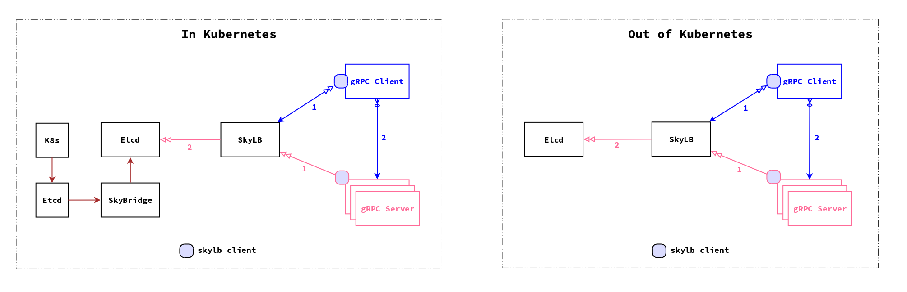

# SkyLB Design Doc

## Disclaimer

The file load-balancing.md is copied from github.com/grpc/grpc for the purpose
of history record.

## Overview

Different from traditional RPC system, gRPC is based on HTTP2 thus the
recommended way to call an RPC is to create one long lived connect and use it
for all clients (multiplexing and streaming).

It has the benefit of very high efficiency and throughput. However, it gives
the traditional load balance architecture a difficulty to fit in. It also
doesn't fit well with Kubernets' load balance architecture. These architectures
works nicely for ephemeral connections, but failed badly in gRPC.

To fix this issue, a load balancing architecture proposal was created by the
gRPC dev team in Febrary, 2016 and reached its maturity around July, 2016. We
cached the proposal as described in the disclaimer at the top of this document.
The core module in this proposal is an external load balancer which aims at
both flexibility and the simplicity for the gRPC client programming.

With this proposal, gRPC team also implemented the code in gRPC library (for
both Golang and Java) to talk to the external load balancer. The following
files contain relevant code:

- https://github.com/grpc/grpc-go/tree/master/naming
- https://github.com/grpc/grpc-go/blob/master/balancer.go
- https://github.com/grpc/grpc-go/blob/master/clientconn.go

However, there is not an official implementation for the external load balancer
(and probably there will not be an official one since every company has its
distinct production environment). This is the reason we initiated the project
SkyLB.

## Architecture of SkyLB

SkyLB: an external gRPC load balancer based on SkyDNS. The design follows the
gRPC "Load Balancer Architecture" proposal and can be used both in and out of
Kubernetes.

Note: when we first started this project, we designed the balancer around
SkyDNS, hence the project name SkyLB. We soon evolved the design a little away
from SkyDNS, but kept the name.

As shown in the diagram, the architecture is almost the same in or out of
Kubernetes (except the existence of Kubernetes in the left diagram), especially
from the gRPC client's and service's perspective (let's call them client
instance and target instance respectively). But there are still subtle
differences between them. We'll leave the differences to a later section, and
here we focus on how the architecture works in general:

- All service info is saved in an etcd cluster.

- One or more SkyDNS servers talk to the etcd cluster.

- SkyLB service is highly available (more than one instances). since
	its load is rather light and stable, the address of each instance is
	manually saved in SkyDNS (etcd, to be precise).

- At the first step, both the gRPC clients and services ask SkyDNS to resolve
	the location of SkyLB instances. One SkyLB instance will be randomly chosen.

- Target instance perspective

	- After a SkyLB instance is chosen, the target service sends a gRPC call to
		SkyLB with a streaming request (note: this is different from the
		proposal, in which the call is reversed).

	- The request is treated as a heartbeat or load report. With a fixed
		interval, the target service keeps sending requests to SkyLB.

	- SkyLB finds the remote address of the target instance, and saves it with
		other info (priority and weight) to etcd with a TTL.

- Client instance perspective
	- After a SkyLB instance is chosen, the gRPC client sends a gRPC call (with
		the target service name) to SkyLB, and receives a streaming response.

	- SkyLB should return a response right after the request arrives, and
		whenever the service changes.

	- The response contains all services currently alive by the knowledge of
		SkyLB.

	- The client establishes a gRPC connection to all target instances. When
		the client is notified for service change, it update the connections.

	- For each RPC call, the client instance chooses one connection to send
		requests. We can use the built-in RoundRobin policy to choose
		connection. In future we might have more complex load balancing
		policies.

## With or Without Kubernetes

In regular environment, service management is through service register and
service discovery. Normally, the target service instances send heartbeats
peoriodically to service controller, and clients ask service controller
constantly for available service instances.

Kubernetes has its own service management and load balancing mechanism. Since
all pods are created and managed by the replication controller, the target
service instances don't need to register themselves, Kubernetes JUST know who
they are and where they locate, without further ado.

The mechanism difference between with and without Kubernetes introduces subtle
treatment of SkyLB in and out of Kubernetes.

- With Kubernetes

	- We deploy SkyDNS (with its etcd cluster). Since each node has been hooked
		up with SkyDNS, a default service name resolving is enough.

	- When the target service instances send requests to SkyLB, SkyLB doesn't
		need to treat these requests as heartbeats, since Kubernetes already
		know the target service instances.

	- SkyLB can still use the requests to update etcd: to update the loads of
		the target service instances. It can be used for more complex load
		balancing strategies.

- Without Kubernets

	- We deploy SkyDNS (with its etcd cluster). Since our production environment
		has not been setup with SkyDNS, we need to specify the SkyDNS location
		when resolve service name.

	- The gRPC requests from the target service instances to SkyLB have to be
		treated as heartbeats, and SkyLB saves the relevant info into etcd,
		thus acts as a service registry and discovery center.

## Revision 1.1 (2016/10/01)

We removed the SkyDNS dependency in favor of hard coded SkyLB instances.

In Kubernetes, we created a small program "skybridge" which connects to both the
Kubernetes's etcd and SkyLB's etcd. It monitors changes of the Kubernetes's etcd
and copies all endpoints changes to SkyLB's etcd. This is because Kubernetes's
etcd is confined within master by design. So skybridge has to be run on master.

## Revision 2.0 (2017/02/01)

We have been using SkyLB in production for over 3 months, and we encountered
a few in-situ issues. The biggest issue is that SkyLB lacks a diagnostic tool,
so that we can't easily identify issues when the SkyLB cluster is not in good
state. A deep analysis also revealed a design flaw in the original protocol of
SkyLB, in which once a DELETE event was lost in a client there is no way to
fix it except reloading the client.

To solve the above issues and make SkyLB cluster more robust, we decided to
replace its protocol. The following lists the top things to do:

- Change the current resolve protocol so that SkyLB sends full endpoints instead
	of delta. A boolean field "resolve_full_endpoints" can be set by the client
	to enable the new protocol, and if it's not set the old protocol will still
	work. The field will be removed once all current clients upgraded to the
	new protocol.

- With the new protocol, when SkyLB was notified changes in etcd, it would call
	etcd for the full endpoints and deliver it to clients. This is different
	from the old protocol in which when it receives the notification, it
	delivers the delta to clients.

- Add a timed process in SkyLB to fetch the full endpoints from etcd and
	deliver them to clients. This design saves the clients (Java or Golang)
	from implementing the same logic again.

- In the client side of SkyLB API, a local full endpoint list should be
	maintained. And each time a new full endpoint list was delievered by SkyLB,
	the API should calculate the delta udpates, and update the load balancers
	accordingly.

- Using the gRPC health API, a client should check the connectivity every a
	few seconds. In a fixed time period, if the connectivity is consistently
	broken, the client should reconnect (by initiating a DELETE then ADD event).

- A new API should be instroduced for client to report and update its instance
	list to SkyLB service. A new UI will be implemented in future to use this
	API to provide diagnostic functions to OPS. The UI provides:

	- Show instance list of a client/service.
	- Show connected service instances of a client.
	- Add/delete a service instance to a client.
	- Put a service instance in-to/out-of LameDuck mode.

	For some of the functions, we also provide HTTP URLs for OPS to drive
	through command line.

### Diagnostic Protocol

After a client connects to the SkyLB server, it starts a two-way gRPC stream
call. The client then comes into a passive mode, waiting for instruction from
the server. When the time comes (for example when user triggers it through UI),
the server sends a specific request to the client, and the client executes
the instruction and returns with a corresponding response.

Note that whenever an error is caused during the streaming talk, the stream
has to be discarded and a new stream should be created (by the client).

The API protocol is defined in skylb-api/proto/api.proto.

## References

- https://github.com/bsm/grpclb
- https://github.com/wothing/wonaming
- https://github.com/benschw/srv-lb
